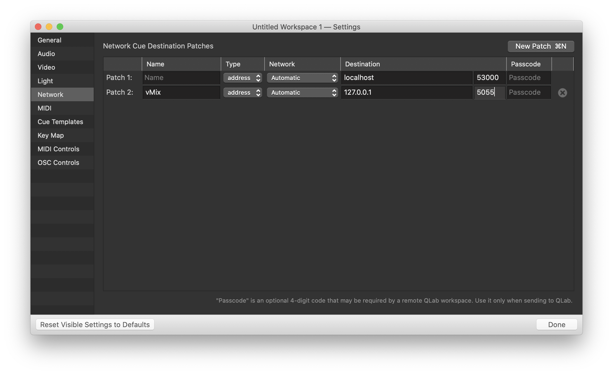
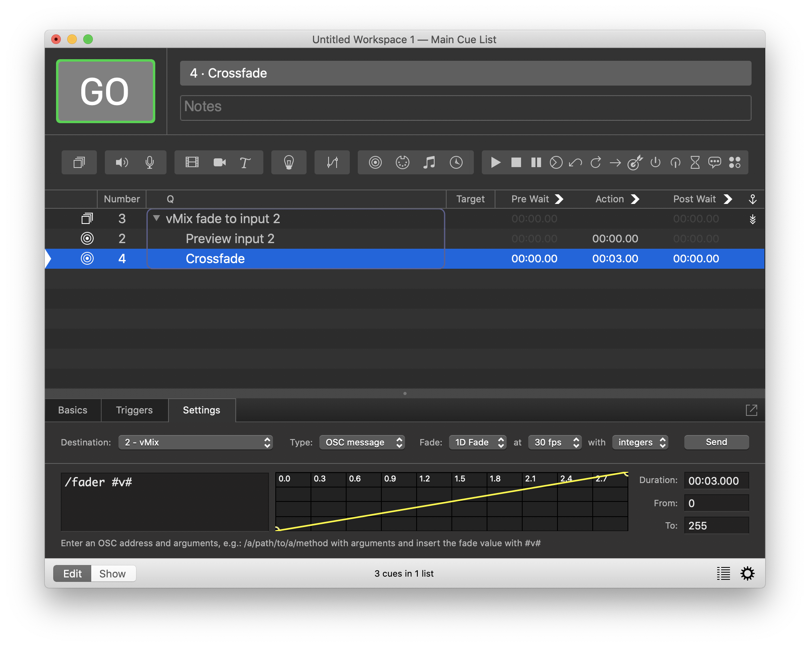

# osc-vmix

Minimal OSC to vMix gateway.

The purpose is to control [vMix](https://www.vmix.com/) using the [Open Sound Control (OSC)](http://opensoundcontrol.org/)
protocol - in particular, using [QLab](https://qlab.app/).


## TL;DR;

```
$ cargo build
# Run on the same machine where QLab is running, and assume vMix is running on a machine with IP 192.168.3.4
$ ./target/debug/osc-vmix 127.0.0.1:5055 192.168.3.4:8088
```

## How to run

Run using cargo, either by executing:

```
$ cargo run <osc listen ip>:<osc listen port> <vmix server ip>:<vmix server port>
```

or by building the executable first,

```
$ cargo build
$ ./target/debug/osc-vmix <osc listen ip>:<osc listen port> <vmix server ip>:<vmix server port>
```

In the examples above, "OSC listen IP" is the IP address on which you want to listen for incoming OSC
messages. Typically this could be `127.0.0.1` if running on the same machine as QLab, or `0.0.0.0` if running
on a machine other than qlab. (If using `0.0.0.0`, usual disclaimers about open ports apply -- be aware that
OSC does not authenticate messages, so *anyone* who has access to your network can send you requests).

Given that OSC (for messages sent by QLab) utilizes the UDP protocol, it is recommended to run this utility
on the same machine as QLab. *Doing so will not eliminate the possibilty of packet loss*, but it will reduce
the probability of packet loss.

The value for `<osc listen port>` can be pretty much choosen freely (but should be between 1025 and 65535),
but must match with what will be configured in qlab.

The second IP address, `<vmix server ip>`, is the IP address of the machine that vMix is running on. Unless
vMix is configured otherwise, the vMix API listens on port `8088`.

Currently this utility does not support authentication towards vMix, so vMix API authentication must be
disabled (which is the default).

Assuming that this utility is running on the same machine as qlab, and vMix is running on `192.168.3.4`:

```
$ cargo run 127.0.0.1:5055 192.168.3.4:8088
```

## Using with QLab

Please note that **nothing in this utility restricts use to QLab** -- it could be used alongside with any
software that sends OSC messages. But as the original use case was with QLab, this is what's documented here.

### QLab configuration

Go to Settings->Network, and under "Network Cue Destination Patches", add a "New Patch", using
destination `127.0.0.1` (if this utility is running on the same machine) or the IP address that this utility
is runing on, and the port chosen above (`5055` in the example).




### QLab cues

After QLab settings are done, network cues can be created:

  - Create a new queue of type ["Network"](https://qlab.app/docs/v4/control/network-cues/)
  - In the "Destination" dropdown, select the entry that was generated in qlab settings above
  - Type "OSC message"
  - Set time and fade parameters as appropriate for the queue

The following screenshot shows an example of a qlab group cue that first pulls an input into preview, and then
cross-fades to that input over three seconds. (In particular, the screenshot shows the second part of the
group, ie. the crossfade):




## Currently supported OSC messages

The following OSC messages are currently implemented;

### Load input to preview (`/vmix/preview`)

Syntax:

```
/vmix/preview <input; string or integer>
```

Sends the selected input to preview. The input can be identified by number, name or UUID, as described in
[the vMix API documentation](https://www.vmix.com/help23/index.htm?DeveloperAPI.html).

This OSC message invokes the vMix API `PreviewInput` function.


### Cut input to active output (`/vmix/cut`).

Syntax:

```
/vmix/cut <input; string or integer>
```

Sends the selected input directly to the active output, without sending it to preview first. The input can be
identified by number, name or UUID, as described in [the vMix API documentation](https://www.vmix.com/help23/index.htm?DeveloperAPI.html).

This OSC message invokes the vMix API `CutDirect` function.


### Fader control (`/vmix/fader`).

```
/vmix/fader <position; integer or float (integer recommended); 0-255>
```

This is equivalent to the vMix `SetFader` API call and shortcut, or to pulling the crossfader between preview
and active.

In combination with qlab fades, this allows vMix to cross-fade from preview to output using whatever fade time
is specified in qlab.

The parameter should be a single value between `0` and `255`. Values between `1` and `254` will progressively
fade to preview, and `255` will complete the fade and flip-flop active and preview. Make sure that the value
`255` is only sent once.

The screenshot above shows an example of integrating this with a qlab 1D fade.

In the qlab fade, the "fps" value will dictate how smooth the fade appears to be. `1 fps` and also `10 fps`
will make the fade not look smooth. `60fps` and above will likely overload the vMix API. Usable values
appear to be `20 fps` and `30 fps`, but also might depend on the output encoding and frames per seconds set
in vMix. (There isn't really much point in this value being higher than the vMix output fps).


### Raw messages (`/vmix/raw`)

Syntax:

```
/vmix/raw <string; API request and parameters>
```

This is a catch-all message that takes a string, and will pass that to vMix API as-is. The string parameter
can be any value that would follow the `?` character in a [vMIX API HTTP request](https://www.vmix.com/help23/index.htm?DeveloperAPI.html),
eg. `/vmix/raw Function=Fade&Duration=1000`
